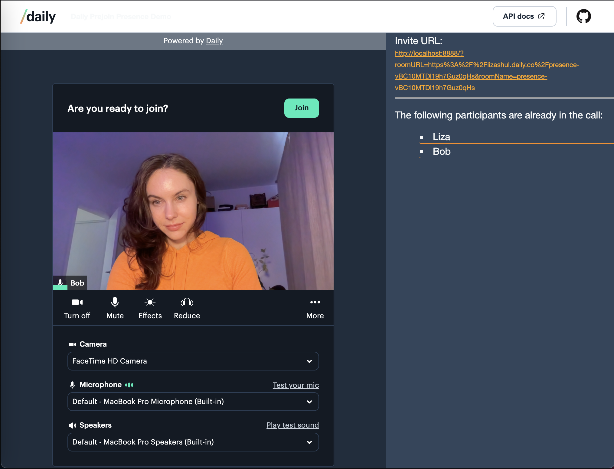

# Daily Prejoin Presence

This demo shows a list of participants who have already entered a video call. This allows a user who is about to enter a Daily room to know who is already in the room before they join the call.

## Prerequisites

- [Sign up for a Daily account](https://dashboard.daily.co/signup).

## How the demo works

This demo uses Daily Prebuilt to embed a full-featured video call on the client. It uses stateless Netlify functions to create Daily rooms and retrieve their presence information with Daily's RESET API.

## Running locally

1. Run `git clone git@github.com:daily-demos/daily-prejoin-presence.git`
1. Run `cd daily-prejoin-presence`
1. Run `npm i`
1. Copy `example.env` and replace `DAILY_API_KEY` with your [Daily developer API key](https://dashboard.daily.co/developers). **Note:** Do _not_ submit this file to version control.
1. Run `npm run dev`

## Contributing and feedback

Contributions are welcome in the form of GitHub issues or pull requests.

## What's next

A couple of ways to extend the functionality in this demo include:

* Update the presence list when participants join or leave a room (currently, the presence list is updated once per call prejoin.)
* Display _when_ a user has joined the call in the presence list.

## Related blog posts/guides

* Daily's [REST API documentation](https://docs.daily.co/reference/rest-api)
* [Creating video call rooms securely with Daily's REST API](https://www.daily.co/blog/creating-video-call-rooms-securely-with-dailys-rest-api/)